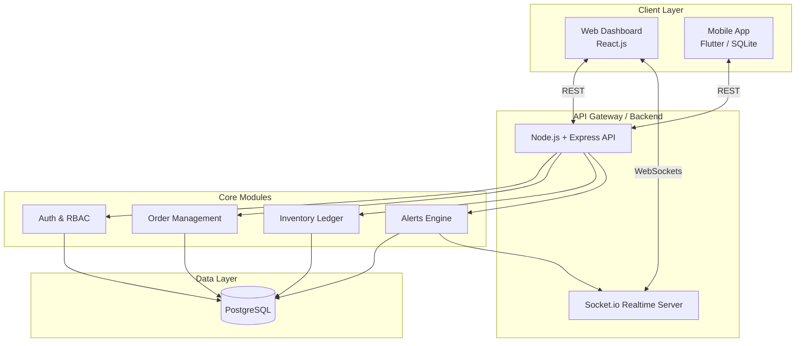

# System Architecture & Tech Stack Strategy

## 1. High-Level Architecture
The system follows an **API-First, Modular Monolith** architecture. This ensures high development velocity for a 48-hour hackathon while maintaining a clean separation of concerns that mimics enterprise production systems.

## 2. Technology Stack & Justification

### 2.1 Web Frontend: React.js (Vite) + Tailwind CSS + Recharts
* **Why it's better:** 
  * **React (Vite):** Blazing fast setup and hot-reloading. The component-driven model is perfect for building complex dashboards quickly.
  * **Tailwind CSS:** Allows styling without leaving the HTML/JSX. Crucial for moving fast during a hackathon without writing messy, unmaintainable CSS files.
  * **Recharts:** Provides beautiful, animated charts out-of-the-box for the Admin Dashboard (stock trends, consumption graphs) with minimal configuration.
* **Alternative Rejected (Vue/Angular):** While Vue is great, the React ecosystem has a broader range of copy-pasteable dashboard templates and charting libraries optimized for quick hackathon wins.

### 2.2 Mobile App: Flutter
* **Why it's better:** 
  * Compiles to native Android and iOS from a single Dart codebase.
  * **QR/Barcode Scanning:** Flutter has robust, easy-to-implement camera plugins (`mobile_scanner`), which is a killer feature for the "Scan-to-Receive" demo.
  * **Offline-First:** Excellent support for local databases (Hive or SQLite) allowing rural pharmacists to scan and receive drugs without internet, syncing to the backend once a connection is restored.
* **Alternative Rejected (React Native):** React Native is a strong contender, but Flutter's UI rendering engine is more consistent across varying devices, meaning fewer device-specific bugs during a live demo.

### 2.3 Backend: Node.js + Express (TypeScript)
* **Why it's better:**
  * **Language Uniformity:** If you use React for the web, using Node/JS for the backend reduces context-switching for the team.
  * **Non-blocking I/O:** Node is natively asynchronous, making it the absolute best choice for handling thousands of WebSocket connections (for live dashboard updates) without choking.
* **Alternative Rejected (Python/Django or Java):** Python/Django is great for rapid CRUD, but handling real-time WebSockets (Channels) is significantly heavier and more complex to configure under a 48-hour deadline than Node's `Socket.io`.

### 2.4 Database: PostgreSQL
* **Why it's better:**
  * **ACID Compliance:** Inventory and supply chain systems are essentially financial ledgers. You *cannot* have eventual consistency or lost updates when dealing with stock quantities.
  * **Relational Integrity:** Strict foreign keys between Orders, Shipments, and Inventory prevent orphan records.
* **Alternative Rejected (MongoDB):** MongoDB's schema-less nature is dangerous for inventory ledgers. Double-deductions of stock or missing shipment references are much harder to prevent in NoSQL without writing complex application-level logic.

### 2.5 Real-time Layer: Socket.io
* **Why it's better:** 
  * Wraps standard WebSockets with auto-reconnection, broadcasting, and fallback mechanisms. It allows the backend to instantly "push" a low-stock alert or chart update to the Admin Web Dashboard the exact second a pharmacist logs consumption on their mobile app.
